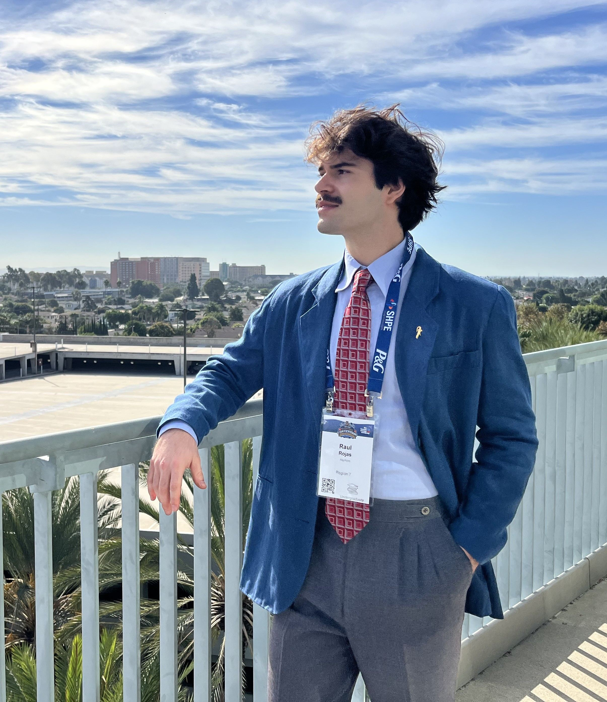

  

<h1 align="center">Hi, I’m Raul Rojas 👋</h1>

  <a href="https://www.linkedin.com/in/raúl-rojas">LinkedIn</a> •
  <a href="mailto:raul.rojas@ufl.edu">Email</a>

---

### 🚀 About Me
I’m a **rising junior** at the **University of Florida** with a focus on machine‑learning and multimodal‑AI solutions. I land at the cross-roads between societal organization, NLP, and human‑centered design. When I'm not studying for my Computer Science (B.S.) and Anthropology (B.A.) degrees, I work to humanize AI while building up my company. I’m actively seeking AI/ML engineering internships for Summer 2026.

---
